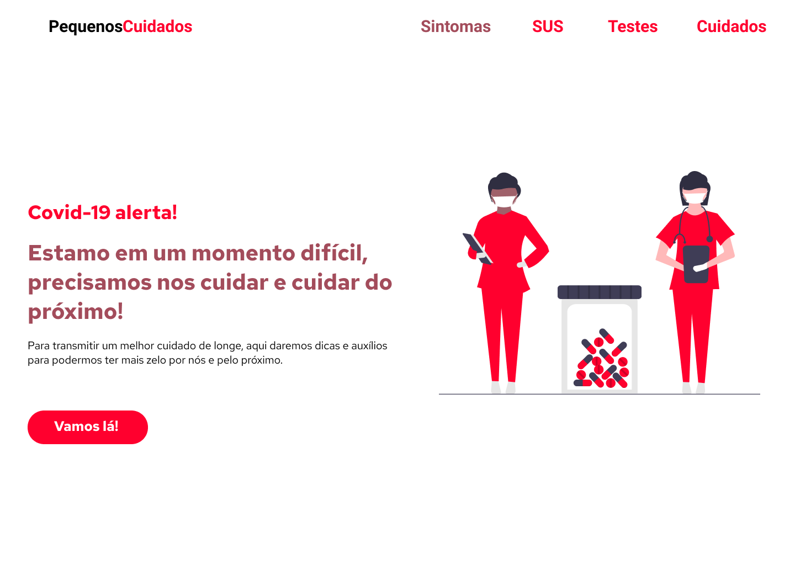
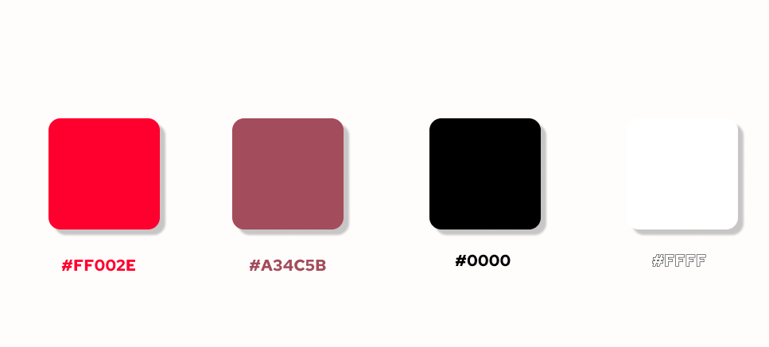

# Covid Home

    

## Paleta de cores

    

HomePage simples usando Flexbox

## Propriedades usadas do FlexBox 

- display: flex;
- flex-direction: column
- flex-direction: row
- justify-content: space-evenly
- justify-content: space-around

## Referência de imagem

[Undraw](https://undraw.co/)

Autora
----

Desenvolvido por [Yasmim Barbosa Vieira](https://www.linkedin.com/in/yasmim-barbosa/) - Desenvolvedora Front-end

